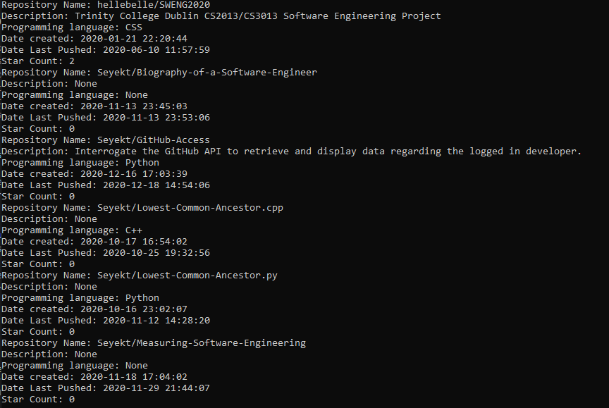

# GitHub-Access
Interrogate the GitHub API to retrieve and display data regarding the logged in developer.

If a file named "token.txt" containing a GitHub token is found in the same directory as the script, it will be used. Otherwise the user will be asked for a username.

